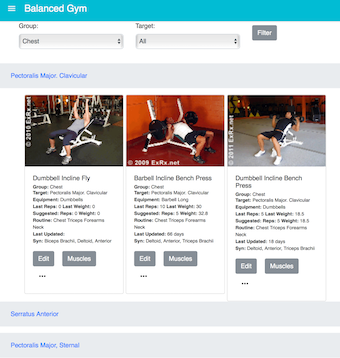
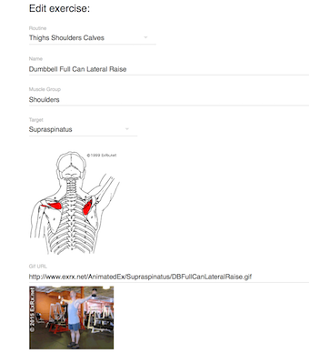
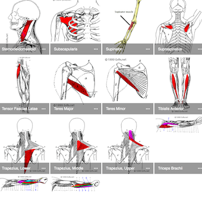

# Balanced Gym

Official site for the Balanced Gym App.

Complementary dashboard and web app to load/setup/track data for Balanced Gym

##  Technologies

React, Redux, Flow, RxJS, Material-ui, NodeJs, Express, Mongoose, Atlas/MongoDB, Heroku

## Screenshots
1- Complete Detailed list of exercises with animations and filters

- 

2- Exercise creation and edition
- 

3- Comlete muscles pictures including target and synergists
- 

